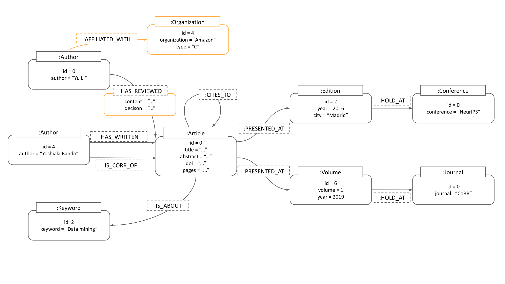
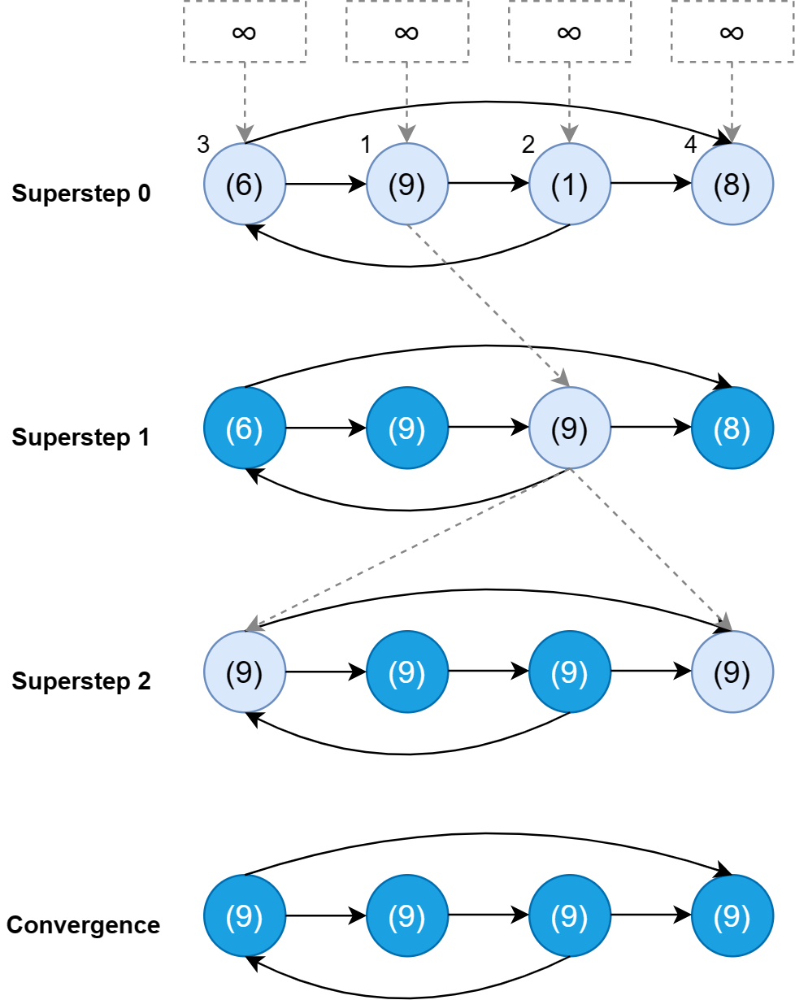
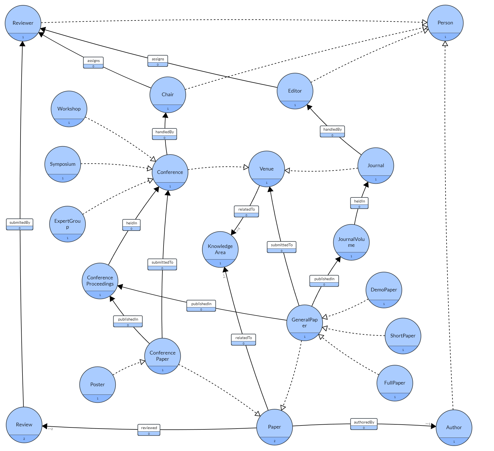

# Semantic Data Management for Scientific Articles

This repository houses the coursework divided into four key segments: Property Graphs (utilizing Neo4j), Distributed Graphs (leveraging Pregel), Knowledge Graphs (employing GraphDB), and a culminating project that integrates these graph databases for machine learning applications.

## Data

The dataset originates from [DBLP](https://dblp.uni-trier.de/). To align with the course's toolset, the data undergoes preprocessing to synthetically generate certain fields like citations, abstracts, and keywords. The preprocessing code is available in the [preprocessing.ipynb](property_graphs/preprocessing.ipynb) file within the property graphs directory. The preprocessed data resides in the [data](data) folder.

## Property Graphs

This segment focuses on loading data into a **Neo4j** database. The loading process is facilitated by the [loading.py](property_graphs/loading.py) script. Queries for specific questions are stored in the [cypher](property_graphs/cypher) folder. For an in-depth explanation of the architecture, its extensibility, and the queries, refer to the [report](property_graphs/reports/report.pdf).

## Distributed Graphs

Here, the Think Like a Vertex (TLAV methodology is employed, using the **Pregel** framework for distributed graph processing. Algorithms for shortest-path (Dijkstra) and PageRank are implemented and can be found in the [src](distributed_graphs/src) folder. A comprehensive report detailing the approach, results, and conclusions is available in the [report](distributed_graphs/reports/report.pdf) file.

## Knowledge Graphs

In this part, data is ingested into a **GraphDB** database. The ABOX and TBOX definitions are housed in the [src](knowledge_graphs/src) folder. The ABOX construction code is in the [abox_definition.ipynb](knowledge_graphs/src/abox_definition.ipynb) file. The report, which includes the proposed TBOX and relevant queries, is located in the [report](knowledge_graphs/reports/report.pdf) file.

## Final Project

The final project delves into graph embeddings for data analytics. [sentence-transformers](https://www.sbert.net/) are used to embed article titles (nodes), and an heterogeneous graph neural network is constructed using [PyG](https://pytorch-geometric.readthedocs.io/en/latest/). The code for building the graph and predicting article groups is in the [src](final_project/src) folder. A detailed report outlining the methodology, results, and conclusions is in the [report](final_project/reports/report.pdf) file.
